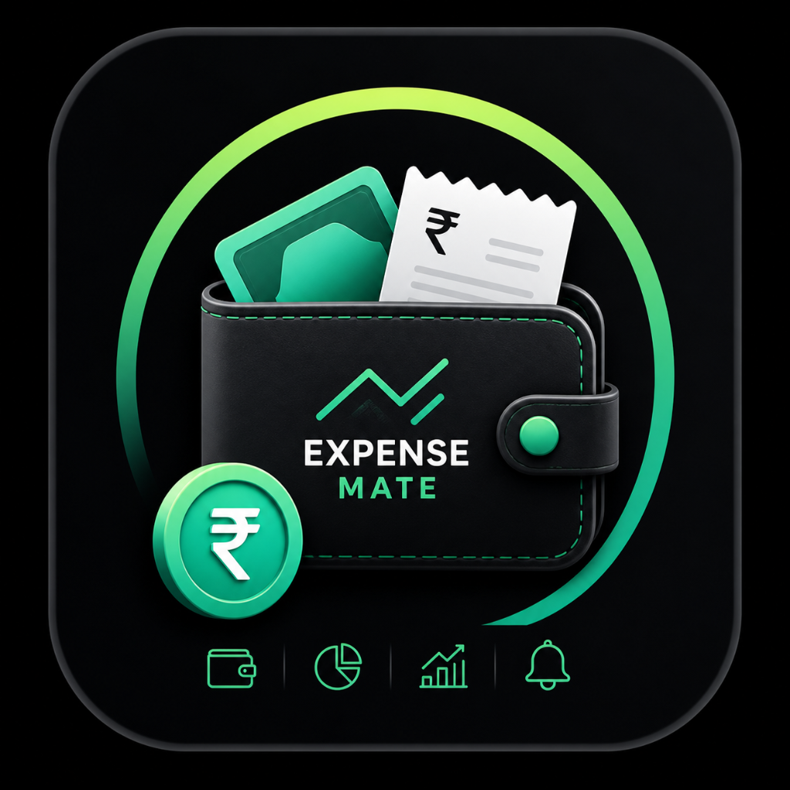

# 💰 Expense Mate

> A modern personal finance management app built with Flutter to help users track income, manage expenses, monitor budgets, and understand their spending habits.

<p align="center">
  
</p>

<p align="center">
  <strong>Save More, Stress Less.</strong>
</p>

---

## 📱 About the Project

**Expense Mate** is a personal expense tracking application developed using **Flutter**. It provides a simple and organized way to manage daily income and expenses while helping users monitor their monthly budgets and understand their spending patterns.

The application combines **local storage, Firebase authentication, cloud synchronization, analytics, budget monitoring, and a modern mobile UI** into a single finance management solution.

The project is designed with a modular structure so that existing features can be maintained easily and future improvements can be added without affecting the core application.

---

## ✨ Features

### 💰 Income & Expense Tracking

* Add income and expense transactions
* Store transaction title, amount, category, and date
* View recent and previous transactions
* Delete transactions when required
* Automatically calculate balance, income, and expenses

### 🎯 Budget Management

* Set a monthly budget
* Track spending against the budget
* Monitor budget usage percentage
* Warning at approximately **80% usage**
* Exceeded-budget alert at **100% or above**

### 📊 Analytics & Smart Insights

* Category-wise expense analysis
* Weekly spending summary
* Monthly spending summary
* Highest spending category
* Visual charts using `fl_chart`
* Simple rule-based financial insights

### 🔐 Google Authentication

* Secure Google Sign-In
* Firebase Authentication integration
* Automatic login session handling
* User profile information from the authenticated account
* Logout support

### ☁️ Cloud Synchronization

* Firebase Cloud Firestore integration
* User-specific transaction storage
* Cloud backup and synchronization support
* Local-first approach for normal app usage

### 💾 Offline Storage

* SQLite database for local transactions
* SharedPreferences for settings and budget values
* Application remains usable without continuous internet access

### 🎨 Modern UI/UX

* Premium dark interface
* Transparent / Liquid Glass inspired components
* Modern gradients and ambient backgrounds
* Smooth page transitions
* Animated financial values
* Staggered entrance animations
* Interactive dashboard components
* Modern floating navigation and action controls

### 🔄 Refresh & Interaction

* Pull-to-refresh support
* Dashboard refresh
* Transaction list refresh
* Smooth UI updates after data changes

---

## 🛠️ Tech Stack

| Technology                  | Purpose                            |
| --------------------------- | ---------------------------------- |
| **Flutter**                 | Mobile application framework       |
| **Dart**                    | Programming language               |
| **Provider**                | State management                   |
| **SQLite / sqflite**        | Local transaction storage          |
| **SharedPreferences**       | Local settings persistence         |
| **Firebase Authentication** | Google Sign-In                     |
| **Cloud Firestore**         | Cloud database and synchronization |
| **fl_chart**                | Charts and analytics               |
| **Google Fonts**            | Application typography             |
| **flutter_native_splash**   | Splash screen                      |
| **flutter_launcher_icons**  | Application icon                   |

---

## 🏗️ Architecture

Expense Mate follows a modular application structure that separates UI, state management, business logic, and data handling.

```text
User
 │
 ▼
Presentation Layer
 ├── Dashboard
 ├── Transactions
 ├── Analytics
 ├── Add Transaction
 ├── Settings
 └── Login
 │
 ▼
Provider / State Management
 │
 ▼
Application Logic
 ├── Transaction calculations
 ├── Budget management
 ├── Analytics
 └── Smart insights
 │
 ├───────────────────────┐
 ▼                       ▼
SQLite                Firebase
Local Database        Authentication
                      Firestore
 │
 └──────────────┬──────────────┘
                ▼
          Persistent Data
```

---

## 📂 Project Structure

```text
lib/
├── main.dart
│
├── models/
│   └── transaction_model.dart
│
├── providers/
│   └── transaction_provider.dart
│
├── screens/
│   ├── login_screen.dart
│   ├── dashboard_screen.dart
│   ├── add_transaction_screen.dart
│   ├── transaction_list_screen.dart
│   ├── analytics_screen.dart
│   └── settings_screen.dart
│
├── services/
│   ├── database_service.dart
│   └── firestore_service.dart
│
├── widgets/
│   ├── glass_background.dart
│   ├── glass_card.dart
│   ├── animated_count_up.dart
│   └── budget_alert_banner.dart
│
└── utils/
```

> The exact files may vary depending on the current implementation and future UI refactoring.

---

## 📱 Main Modules

### 1. Authentication Module

Handles Google Sign-In and Firebase Authentication.

### 2. Dashboard Module

Displays:

* Total balance
* Total income
* Total expenses
* Budget progress
* Recent transactions
* Smart insights

### 3. Transaction Module

Allows users to:

* Add transactions
* View transactions
* Delete transactions
* Categorize expenses

### 4. Analytics Module

Provides:

* Weekly analysis
* Monthly analysis
* Category breakdown
* Charts
* Spending insights

### 5. Budget Module

Handles:

* Monthly budget
* Budget usage
* Warning alerts
* Exceeded-budget status

### 6. Settings Module

Manages application preferences and user account actions.

### 7. Cloud Sync Module

Uses Firebase Firestore for user-specific cloud storage and synchronization.

---

## 🗄️ Data Storage

### Local Database

SQLite is used as the primary local storage for financial transactions.

Typical transaction information includes:

```text
Transaction
├── ID
├── Title
├── Amount
├── Type
├── Category
└── Date
```

### User Settings

SharedPreferences stores locally persisted values such as:

```text
Budget
User Preferences
Application Settings
```

### Cloud Database

Firestore follows a user-specific structure similar to:

```text
users
└── {userId}
    └── transactions
        ├── transaction_1
        ├── transaction_2
        └── transaction_3
```

---

## 🔄 Data Flow

```text
User Action
    ↓
Flutter UI
    ↓
Provider
    ↓
Business Logic
    ↓
SQLite
    ↓
UI Update
    ↓
Optional Firestore Sync
```

The local database provides fast access, while Firestore can be used for cloud backup and synchronization.

---

## 🚀 Getting Started

### Prerequisites

Install the following:

* Flutter SDK
* Dart SDK
* Android Studio or another Flutter-compatible IDE
* Android SDK
* Git
* A physical Android device or Android emulator

Check Flutter installation:

```bash
flutter doctor
```

---

## 📥 Installation

Clone the repository:

```bash
git clone https://github.com/MUNEESHKUMARM/ExpenseMate.git
```

Move into the project:

```bash
cd ExpenseMate
```

Install dependencies:

```bash
flutter pub get
```

Run the application:

```bash
flutter run
```

---

## 🔐 Firebase Configuration

Expense Mate uses Firebase for authentication and cloud functionality.

Before running Firebase-related features, configure the Android application in Firebase.

### Required

1. Create a Firebase project.
2. Add an Android application.
3. Use the same Android package/application ID as the Flutter project.
4. Enable **Google Sign-In** under Firebase Authentication.
5. Configure the required Android SHA-1 fingerprint.
6. Download `google-services.json`.
7. Place it inside:

```text
android/app/google-services.json
```

8. Enable **Cloud Firestore** when cloud synchronization is required.

### Important

Do not publish private credentials, signing keys, passwords, or other sensitive configuration files in a public repository.

---

## 🔑 Google Authentication Flow

```text
Open App
   ↓
Check Firebase Session
   ↓
Already Logged In?
 ┌───────┴───────┐
 │               │
Yes              No
 │               │
 ▼               ▼
Dashboard     Login Screen
                  │
                  ▼
            Google Sign-In
                  │
                  ▼
         Firebase Authentication
                  │
                  ▼
              Dashboard
```

---

## 📊 Budget Alert Logic

Expense Mate uses simple budget thresholds to provide spending feedback.

```text
Budget Usage

0% ─────────────── 79%
        Normal

80% ────────────── 99%
        Warning

100%+
        Exceeded
```

These alerts are designed to help users become more aware of their spending.

---

## 🎨 UI/UX Design

The application uses a modern dark fintech-inspired visual language with:

* Transparent surfaces
* Liquid Glass inspired elements
* Soft ambient lighting
* Rounded components
* Smooth transitions
* Animated financial values
* Clean typography
* Minimal visual clutter

The design goal is to combine functionality with a premium and comfortable user experience.

---

## ⚡ Performance

The project focuses on:

* Local-first data access
* Efficient Provider state updates
* Minimal unnecessary rebuilds
* Optimized animations
* Reusable UI components
* Smooth scrolling
* Offline transaction access

Cloud operations should not unnecessarily block the local user experience.

---

## 🧪 Testing

Before creating a release build, run:

```bash
flutter analyze
```

Then:

```bash
flutter build apk --debug
```

For a release APK:

```bash
flutter build apk --release
```

For an Android App Bundle:

```bash
flutter build appbundle
```

---

## 📦 Build Output

Release APK:

```text
build/app/outputs/flutter-apk/app-release.apk
```

Release App Bundle:

```text
build/app/outputs/bundle/release/app-release.aab
```

---

## 🔒 Security Notes

This project uses Firebase Authentication and Firestore.

For a production deployment:

* Configure Firestore Security Rules properly.
* Restrict database access to authenticated users.
* Do not store passwords inside the application.
* Never commit private signing keys.
* Never commit passwords or environment secrets.
* Keep release signing credentials secure.

A user should only be able to access their own financial data.

---

## 📸 Screenshots

Add application screenshots here:

```text
screenshots/
├── login.png
├── dashboard.png
├── transactions.png
├── analytics.png
└── settings.png
```

Example Markdown:

```markdown


```

---

## 🗺️ Future Enhancements

Possible future improvements include:

* Advanced financial reports
* Export transactions to PDF/CSV
* More detailed spending analytics
* Recurring transactions
* Custom categories
* Improved cloud conflict handling
* Multi-device synchronization
* Personalized financial recommendations
* Automated monthly reports

---

## 🎓 Project Highlights

This project demonstrates practical usage of:

* Flutter mobile development
* Dart programming
* State management
* Local database integration
* Firebase Authentication
* Cloud Firestore
* Data visualization
* Responsive UI/UX
* Animation and interaction design
* Offline-first application concepts

---

## 👨‍💻 Author

**MUNEESHKUMAR M**

B.Tech Information Technology

GitHub:
https://github.com/MUNEESHKUMARM

---

## 📄 License

This project is intended for educational and development purposes.

You can add a specific open-source license such as **MIT License** when required.

---

## ⭐ Support

If you find this project useful, consider giving the repository a ⭐ on GitHub.

---

### 💙 Expense Mate

**Track your money. Understand your spending. Save more, stress less.**
